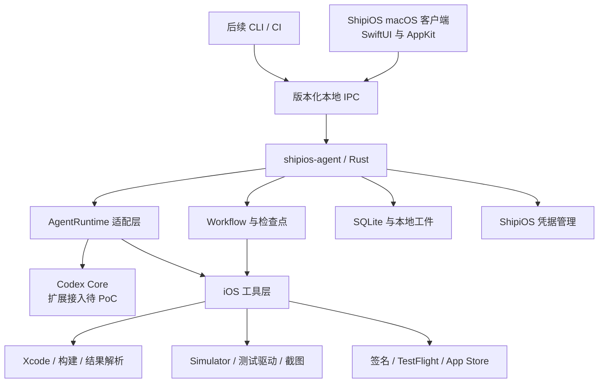

# 技术架构

状态：目标架构草案。`codex-core + extension-api` 是用户明确偏好；固定版本的源码入口已核对，内嵌编译与运行仍待验证。当前实现范围见 [本地原型报告](08-local-prototype.md)。

## 1. 分层与职责



| 模块 | 负责 | 边界 |
| --- | --- | --- |
| macOS 客户端 | 项目、任务、时间线、diff、证据、授权和设置 | 不承载长任务执行与领域状态机 |
| Agent Host | 进程生命周期、IPC、取消、版本协商、配置组装 | 不要求用户另装或配置 Codex CLI |
| Workflow | 阶段、进入条件、预算、重试、检查点、外部副作用记录 | 模型回答不能直接推动已验证状态 |
| AgentRuntime | 编码任务、会话、事件、工具注册与权限桥接 | 业务层不依赖 Codex 内部类型 |
| iOS Tools | 参数校验、子进程执行、结构化诊断、工件生成 | 核心命令使用参数数组，不拼接用户 shell 文本 |
| 存储 | 项目/运行/步骤索引、事件、工件元数据 | 大日志、截图、xcresult 独立文件存放 |
| Secrets | 模型和发布凭据引用、作用域、撤销 | 凭据不写入项目配置或 Agent 上下文 |

## 2. 技术选择状态

| 项目 | 草案 | 理由 / 待验证项 |
| --- | --- | --- |
| 客户端 | SwiftUI + 必要 AppKit | 适配 macOS 项目选择、窗口和系统能力；不是用户已定案选型 |
| Runtime | Rust 独立可执行进程 | 符合内嵌 Codex 方向；与 UI 生命周期解耦 |
| UI ↔ Agent | M1 建议 stdio JSON-RPC；后续评估 UDS | 原对话偏向 UDS；stdio 更便于先验证父子进程协议 |
| 持久化 | SQLite + 文件工件 | 工作流恢复与证据索引；schema 需版本化 |
| 凭据 | Keychain 独立命名空间 | 验证 core 认证适配是否支持产品自己的存储 |
| iOS 集成 | xcodebuild / xcrun / simctl / XCTest 等 | UI 点击输入驱动需单独选型，不能假设 simctl 全覆盖 |
| 发布 | ASC API 或经过评估的 ASC CLI / fastlane | 逐项验证实际操作、权限、分发许可与结构化输出 |

这里的 JSON-RPC 是 ShipiOS 自有协议草案，不应直接假设与 Codex App Server 协议兼容。

## 3. Codex 接入路线

主路线：在 `shipios-agent` 内经适配层复用 Codex Core；若所选源码版本提供合适扩展点，则以扩展注册 iOS 工具和领域上下文。避免把大量产品逻辑直接改入上游核心。

后续本地源码审计确认 `core-api` 导出 `ThreadManager` 和 `ExtensionRegistryBuilder`，扩展 API 位于 `codex-rs/ext/extension-api`。固定版本的产品适配库和 Agent RPC 已加入 Rust 工作区并用本地假服务验证真实回合；Swift 聊天尚未接入，见 [Agent RPC 验证](190-codex-agent-rpc.md)。[固定版本源码](https://github.com/openai/codex/blob/50d77959bf927293c4b5ddcca81d05331ae582ea/codex-rs/core-api/src/lib.rs)

P0 必须验证：编译与分发依赖、创建/恢复会话、注册一个结构化工具、流式事件、取消、权限决策、配置注入、凭据注入和持久化。记录 commit SHA 与所有补丁。

备选路线：由 ShipiOS 捆绑固定版本的 App Server，通过独立配置和工具适配完成原型。官方文档描述了双向协议、stdio 以及会话操作，但也标明 app-server 命令及 WebSocket 的实验性限制，不能直接当成成熟生产承诺。[官方文档](https://learn.chatgpt.com/docs/app-server)

备选路线只有通过相同的隔离验收才可用于产品；否则只能标为受限原型。采用它应更新决策记录，不静默替换用户偏好的内嵌路线。

## 4. 两类 Provider

- **AgentRuntime**：完整编码运行时，例如 CodexRuntime；未来 ClaudeRuntime 应单独接入。
- **ModelProvider**：运行时访问的模型端点、模型标识、认证方式与协议能力。

二者不能混同。配置一个 `base_url` 不等于支持任意模型 API。首版选一个经验证的 Provider 与认证方式；模型 ID 在配置中选择，不将原对话示例型号写为永久默认。Claude SDK、订阅登录、Responses 兼容网关等都需分别验证。

## 5. 产品状态与领域上下文

Agent 可读取经裁剪的项目快照：workspace、scheme、targets、依赖管理方式、deployment target、Git 基线、最近构建/测试结果、Simulator 标识和签名检查摘要。

每个快照带采集时间与代码树标识；代码改变后旧的通过记录失效。产品 SQLite 保存工作流状态，Codex 会话保存模型上下文，通过稳定 ID 关联，不直接修改上游内部数据库。

## 6. 客户端最小页面

| 页面 | 首版必要内容 |
| --- | --- |
| 项目列表/详情 | 项目路径、scheme、环境状态、最近运行 |
| 任务工作台 | 用户目标、计划、当前步骤、取消/继续、失败处理 |
| 变更与验证 | diff、构建诊断、场景结果、截图和日志 |
| 设置 | 模型连接、凭据状态、数据目录、预算、工具版本 |
| 发布面板（M2） | App/版本/build、材料差异、上传状态、提交授权 |

## 7. 建议源码结构

以下是目标规划。当前实现将配置、存储收敛在 `shipios-core`，工具层为 `shipios-tools`，进程和协议为 `shipios-agent`；后续随真实边界拆分。

```text
apps/macos/                 SwiftUI 客户端
crates/shipios-agent/        Agent 进程入口与 IPC
crates/shipios-workflow/     状态机、预算、恢复
crates/shipios-runtime/      运行时抽象与统一事件
crates/shipios-codex/        所选上游版本的适配与补丁边界
crates/shipios-tools/        Xcode、Simulator、发布工具
crates/shipios-storage/      SQLite、工件与迁移
protocol/                   自有 IPC schema 与版本
skills/                     经授权分发的 iOS 知识
fixtures/                   用于集成验证的最小 iOS 项目
docs/                       产品、设计、决策与验证记录
```

## 8. 升级与分发

固定 Codex commit、Rust/Xcode 工具链和协议版本；先跑集成与隔离回归，再升级。将上游修改收敛在适配层和小型补丁集，保存升级记录。

正式桌面分发前验证 app 与 helper 的签名、公证、更新回滚、缺失 Xcode 的提示和干净机器安装。最低系统版本与分发渠道在 P0 定案，不默认承诺可通过 Mac App Store 分发。
