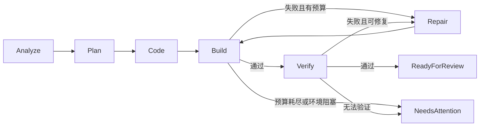

# 工作流与接口草案

状态：ShipiOS 自有领域设计，所有方法名和 JSON 字段均为拟议契约，不是 Codex SDK 的既有 API。

## 1. 核心原则

工作流由代码控制，Coding Agent 完成有边界的任务。每个阶段根据工具结果和验证证据推进；模型说“完成了”不能替代构建退出状态、测试断言或外部服务返回结果。

## 2. 本地开发验证状态机



所有活动阶段均可进入 `Cancelled`、`Failed` 或 `NeedsAttention`。`ReadyForReview` 表示指定范围已验证且材料齐全，不表示已经合并代码或可以无条件发布。

| 阶段 | 输入 | 退出条件 / 工件 |
| --- | --- | --- |
| Analyze | 项目路径、目标、环境 | 明确 workspace/scheme、Git 基线、依赖与运行目标 |
| Plan | 用户任务、验收条件 | 修改范围、场景、预算与权限上下文 |
| Code | 计划、项目快照 | 可审查代码 diff 与新的树标识 |
| Build | 精确代码树、工具链与目标 | 退出状态、诊断、构建产物或明确失败 |
| Verify | 对应构建产物、场景定义 | 断言结果、截图、日志、已知未覆盖项 |
| Repair | 失败证据与剩余预算 | 新 diff；必须重新构建和验证 |
| ReadyForReview | 同一代码树的证据 | 可导出报告与用户决策入口 |

## 3. 修复预算与失败分类

建议默认每次运行最多 3 次自动修复尝试，同时配置总耗时和模型消耗上限；3 次是讨论建议，须经试点校准。一次尝试指根据失败证据进行一轮修改并重新验证，不是每个模型 tool call。

| 失败类别 | 处理 |
| --- | --- |
| 可定位的编译/代码错误 | 在剩余预算内交给 Coding Agent |
| 可复现的场景断言失败 | 保留证据后修复；不得降低断言来获得通过 |
| 缺依赖、缺模拟器、账号无权限 | 标为环境阻塞，提供可操作诊断 |
| 网络临时失败或限流 | 工具级有限退避，独立于代码修复计数 |
| 上传/提交超时，结果未知 | 先查询远端状态，再决定是否重试 |
| 相同错误持续出现或无有效 diff | 提前人工接管，避免空转 |

## 4. 工作区与基线

默认使用隔离 worktree 或受控副本。保存用户指定的起始分支/commit、原工作区脏状态以及纳入任务的未提交更改。用户有未提交改动时，应明确选择包含当前状态或从已提交基线开始，不默认丢弃或覆盖。

每个结果绑定最终代码树摘要、工具链、scheme、destination、配置及场景版本。产生新修改后，下游构建/测试证据失效。将结果合回原工作区前检查冲突；失败或取消后保留改动供审查，不自动执行硬重置。

## 5. 运行时与 IPC

拟议 `AgentRuntime` 操作：创建/恢复会话、执行任务、订阅事件、回应权限请求、取消运行、读取最终结果。能力协商返回是否支持工具注册、恢复、结构化事件、认证方式等。

拟议产品 IPC：`initialize`、`project.inspect`、`run.start`、`run.get`、`run.events`、`run.cancel`、`approval.respond`、`artifact.get`。定义 `protocolVersion` 和最低兼容版本，不将所有上游事件原样暴露到 UI。

```json
{
  "schemaVersion": 1,
  "eventId": "evt-0032",
  "sequence": 32,
  "runId": "run-demo",
  "stepId": "build-02",
  "type": "step.completed",
  "timestamp": "2026-09-16T08:00:00Z",
  "payload": {
    "status": "failed",
    "artifactIds": ["build-log-02"],
    "errorCode": "BUILD_FAILED"
  }
}
```

事件按 run 内序号去重；重连从游标重放。取消请求要能终止关联的进程组，记录清理是否成功。客户端断开后的继续/暂停策略需明确；不把 UI 关闭等同于外部操作已取消。

## 6. 工具契约

| 工具草案 | 主要输入 | 结构化输出 |
| --- | --- | --- |
| `project.inspect` | 路径、候选目标 | 项目、schemes、targets、环境诊断 |
| `xcode.build` | workspace/project、scheme、configuration、destination | exitCode、诊断、产物、日志引用 |
| `xcode.test` | 同上、test plan/选择范围 | 场景状态、断言、结果包 |
| `simulator.launch` | device ID、App 产物、bundle ID | 进程和设备状态 |
| `simulator.runScenario` | 场景、设备、超时 | 操作轨迹、断言、截图 |
| `signing.inspect` | App/target、构建配置 | 只读签名诊断与阻塞项 |
| `release.prepare`（M2） | App、版本、build、材料 | 材料差异、检查报告 |
| `testflight.upload`（M2） | 已验证 archive/export、授权引用 | 操作 ID、远端 build ID、状态 |
| `appstore.submit`（后续） | 明确 submission 对象、授权引用 | 远端 submission ID、确认状态 |

```json
{
  "schemaVersion": 1,
  "tool": "xcode.build",
  "runId": "run-demo",
  "status": "failed",
  "exitCode": 65,
  "diagnostics": [
    {
      "severity": "error",
      "file": "Sources/ProfileView.swift",
      "line": 82,
      "message": "Cannot find 'avatar' in scope"
    }
  ],
  "artifactIds": ["build-log-02"],
  "durationMs": 12500
}
```

解析失败时保留原始退出状态和脱敏日志，明确标注诊断不完整。面向模型的摘要应限制体积，完整输出通过工件查看。

## 7. 数据模型

| 对象 | 必要字段 |
| --- | --- |
| Project | ID、根路径、构建目标、配置版本 |
| Run | ID、Project、目标、基线/最终树、状态、预算、runtime 版本 |
| Step | ID、Run、类型、输入摘要、状态、attempt、时间、错误 |
| Artifact | ID、类型、路径、内容散列、大小、生成步骤 |
| Verification | 场景、代码树/构建产物、断言结果、证据、未覆盖项 |
| Approval | 动作、对象摘要、材料散列、授权范围、失效条件 |
| ExternalOperation | 本地意图 ID、远端 ID、请求摘要、已知状态、最后查询时间 |

Secrets 仅通过引用关联，不能进入普通数据表、事件和模型提示。运行记录应支持导出与清理；保存周期待试点确定。

## 8. 发布工作流与恢复

M2：`Verified → Package → PrepareMetadata → ReadyForUpload → Upload → Processing → TestFlightReady → PrepareSubmission → ReadyForSubmission`。

后续提交：`ReadyForSubmission → AuthorizedSubmit → Submitted → InReview → Approved / Rejected`。远端枚举须在实现时映射，以实际 ASC 接口为准；上传完成不代表处理完成，更不代表审核通过。

提交前显示 App、版本、build、材料差异及动作影响。沿用用户已授予且仍有效的授权；材料或目标发生实质变化则重新授权。审批在执行工具层校验，不能只在 UI 按钮上控制，也不能通过通用 shell 绕过。

外部操作先持久化意图，再执行并记录远端标识。服务不支持幂等键时，在本地锁定同一对象并查询远端去重。崩溃恢复后，未知结果不得盲目重放上传、提审或版本变更。

## 9. 验证证据标准

每个场景标为 `passed`、`failed`、`blocked` 或 `not_run`。至少包含前置状态、设备/系统版本、步骤、预期与实际结果、断言来源和工件。视觉判断单独标为模型判断；关键场景优先使用可重复的 UI 元素或业务断言。

界面和报告必须展示失败、未运行与测试范围，不使用无法解释的“上架就绪 82%”替代具体检查项。
